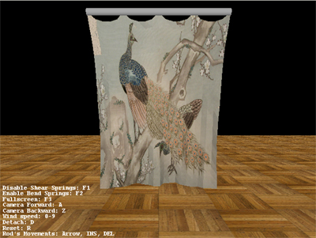
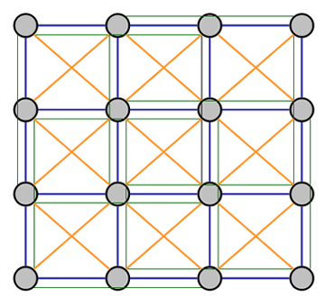

# Mass-spring System

  

In this simulation, a continuous cloth surface is discretized into a finite number of particles, and each particle can be constrained by stretch, shear and bend springs.  The structure is configured as the figure below:

  

The particles are shown in grey, stretch springs in blue, shear springs in orange and bend springs in thinner green lines.  Stretch springs prevent the particles stretching too much.  Shear springs resist shearing movement of the surface.  bend springs prevent the cloth from folding itself too easily.

There are four main steps in the simulation:

1. Reset all forces of the particles to zero.

2. Calculate all forces acting on each particle, such as forces from gravity, springs and air dragging.

3. Step the simulation using numerical integration (Euler explicit integration).

4. Update positions of all particles.

The spring force is calculated upon Hooke's law with the separation between two particles, the spring constant and damping constant.  The equation will become stiff [1] if inappropriate constant values are set, for example, too high spring constant causing strong restoring spring force.  This can lead to numerical instability.  Indeed, it is the drawback of using explicit integration.  Therefore, the cloth in the demo is not very stiff in the current stage.  For the future work, I will apply implicit integration [2] instead of explicit one. 

## References

[1] Xavier Provot. Deformation Constraints in a Mass-Spring Model to Describe Rigid Cloth Behavior. In Graphics Interface, pages 147-155, 1995.

[2] D. Baraff and A. Witkin. Large Steps in Cloth Simulation. Computer Graphics (Proc. SIGGRAPH), pages 43-54, 1998.